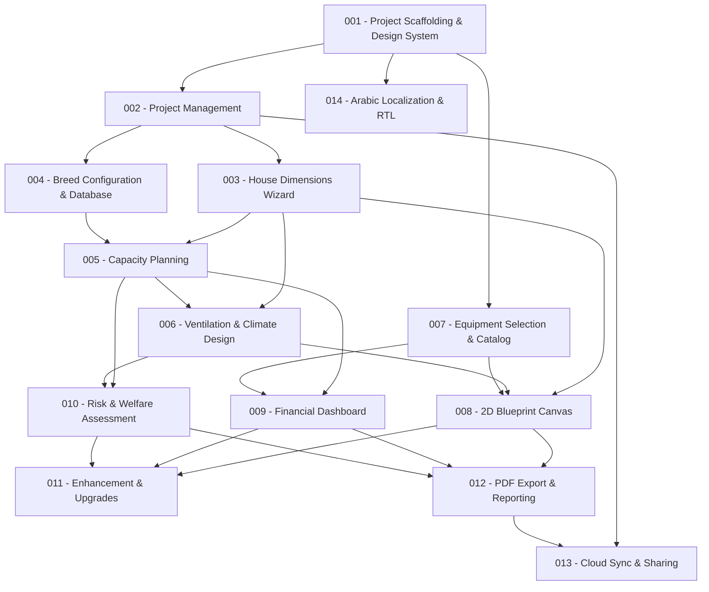

# Feature Decomposition Manifest

**Generated**: 2026-06-24
**Source Documents**:
- [product-spec.md](../product-spec.md)
- [ui-spec.md](../ui-spec.md)
- [constitution.md](../constitution.md)

**Total Features**: 14

## Feature Order

| # | File | Feature Name | Category | Priority | Dependencies |
|---|------|-------------|----------|----------|-------------|
| 1 | `001-project-scaffolding-and-design-system.md` | Project Scaffolding & Design System | :building_construction: Foundation | Must Have | None |
| 2 | `002-project-management.md` | Project Management | :desktop_computer: UI Feature | Must Have | #1 |
| 3 | `003-house-dimensions-wizard.md` | House Dimensions Wizard Step | :desktop_computer: UI Feature | Must Have | #1, #2 |
| 4 | `004-breed-configuration-database.md` | Breed Configuration & Reference Database | :desktop_computer: UI Feature | Must Have | #1, #2 |
| 5 | `005-capacity-planning.md` | Capacity Planning | :desktop_computer: UI Feature | Must Have | #3, #4 |
| 6 | `006-ventilation-climate-design.md` | Ventilation & Climate System Design | :desktop_computer: UI Feature | Must Have | #3, #5 |
| 7 | `007-equipment-selection-catalog.md` | Equipment Selection & Catalog | :desktop_computer: UI Feature | Must Have | #1, #2 |
| 8 | `008-2d-blueprint-canvas.md` | 2D Interactive Blueprint Canvas | :desktop_computer: UI Feature | Must Have | #3, #6, #7 |
| 9 | `009-financial-dashboard.md` | Financial Dashboard & Cost Estimation | :desktop_computer: UI Feature | Must Have | #5, #7 |
| 10 | `010-risk-welfare-assessment.md` | Risk & Welfare Assessment | :desktop_computer: UI Feature | Must Have | #5, #6 |
| 11 | `011-enhancement-upgrades.md` | Enhancement & Upgrade Planning | :desktop_computer: UI Feature | Should Have | #8, #9, #10 |
| 12 | `012-pdf-export.md` | PDF Export & Reporting | :desktop_computer: UI Feature | Must Have | #8, #9, #10 |
| 13 | `013-cloud-sync-and-sharing.md` | Cloud Sync & Link Sharing | :link: Integration | Could Have | #1, #2, #12 |
| 14 | `014-arabic-localization.md` | Arabic Localization & RTL Support | :shield: Cross-Cutting | Should Have | #1 |

## Dependency Graph

## How to Use

Process features sequentially using `/speckit-specify`:

1. Read the feature brief in each numbered file
2. Run `/speckit-specify [paste the feature description from the file]`
3. Complete the spec → plan → tasks cycle for each feature
4. Move to the next feature in order

Features marked as parallelizable can be worked on simultaneously.

## Parallelization Opportunities

- **After #2**: Features #3 and #4 can be built in parallel (both depend on #1, #2 only)
- **After #5**: Features #6 and #7 can be built in parallel (independent of each other)
- **After #8**: Features #9 and #10 can be built in parallel (share dependencies but not each other)
- **Feature #14** (Arabic Localization) can be started any time after #1, ideally after a few UI features are established

## Coverage Matrix

### Product Spec Requirements

| Requirement | Feature(s) | Status |
|-------------|-----------|--------|
| §5.1.1 Project Management (CRUD, categorize, status) | #002 | ✅ Covered |
| §5.1.2 House Dimension Setup (length, width, height, roof, walls, floor, insulation) | #003 | ✅ Covered |
| §5.1.3 Breed Configuration & Reference Database (catalog, auto-retrieve params) | #004 | ✅ Covered |
| §5.1.4 Capacity Planning (max capacity, density indicator, override warnings) | #005 | ✅ Covered |
| §5.1.5 Ventilation & Climate System Design (GPS/manual, fan/inlet/pad config, CFM) | #006 | ✅ Covered |
| §5.1.6 Equipment Selection & Catalog (browse, search, add, custom items, BOM) | #007 | ✅ Covered |
| §5.1.7 2D Interactive Canvas / Blueprint (scaled schematic, zoom, pan, drag-edit) | #008 | ✅ Covered |
| §5.1.8 Financial Dashboard & Cost Estimation (CapEx, OpEx, ROI, cycle slider) | #009 | ✅ Covered |
| §5.1.9 Risk & Welfare Assessment (mortality score, EU compliance, environmental) | #010 | ✅ Covered |
| §5.1.10 Enhancement & Upgrades (recommendations, Before/After, custom proposals) | #011 | ✅ Covered |
| §5.1.11 Export & Sharing — PDF Export (blueprints, BOM, financials, scorecards) | #012 | ✅ Covered |
| §5.2.1 Cloud Sync & Collaboration (Room-to-Firestore, last-write-wins) | #013 | ✅ Covered |
| §5.2.2 Web Link Sharing (upload PDF, shareable link) | #013 | ✅ Covered |
| §5.2.3 Arabic Localization (RTL, full translation) | #014 | ✅ Covered |
| §5.3 French Language Support (Must Have) | #001 | ✅ Covered |
| §5.3 Room Local Database (Must Have) | #001 | ✅ Covered |
| §6.1 Technology Stack (Kotlin, Compose, Room, Hilt, Firebase, Retrofit) | #001 | ✅ Covered |
| §6.3 Authentication & Authorization (anonymous default, Firebase Auth) | #013 | ✅ Covered |

### UI Spec Screens

| Screen / Section | Feature(s) | Status |
|-----------------|-----------|--------|
| §1 Design System & Design Tokens (colors, typography, spacing, shapes) | #001 | ✅ Covered |
| §2 Global UI Component Standards (cards, badges, inputs, bottom sheets) | #001 | ✅ Covered |
| §3 Navigation & Screen Architecture Map | #001, #002 | ✅ Covered |
| §4.1 Home Screen / Dashboard | #002 | ✅ Covered |
| §4.2 House Dimensions Wizard Step | #003 | ✅ Covered |
| §4.3 Blueprint View Dashboard Tab | #008 | ✅ Covered |
| §4.4 Risk Assessment Dashboard Tab | #010 | ✅ Covered |
| §4.5 Financial Analysis Dashboard Tab | #009 | ✅ Covered |
| §4.6 Technical Improvements Dashboard Tab | #011 | ✅ Covered |
| §4.7 Performance Reports Dashboard Tab | #012 | ✅ Covered |
| §4.8 Wizard Steps 2–6 (Breed, Capacity, Ventilation, Equipment, Review) | #004, #005, #006, #007 | ✅ Covered |
| §5 Interactive 2D Canvas Specification | #008 | ✅ Covered |
| §6 Accessibility & Localization | #001, #014 | ✅ Covered |

### Validation Results

- **Completeness**: 18/18 product spec requirements covered ✅
- **Dependency cycles**: None detected ✅ (graph is a DAG — all edges flow downward)
- **Constitution compliance**: All features reference and respect constitution constraints ✅
- **MoSCoW respected**: Must Have features (#001–#010, #012) ordered before Should Have (#011, #014) and Could Have (#013) ✅
